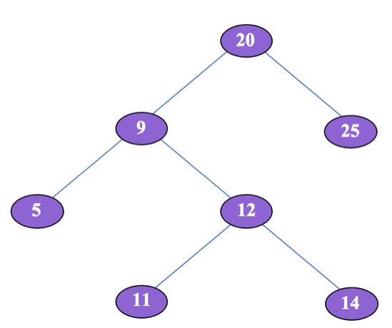

# Binary Search Tree - Successor Search

In a Binary Search Tree **(BST)**, an Inorder Successor of a node is defined as the node with the smallest key greater than the key of the input node (see examples below). Given a node inputNode in a BST, you’re asked to write a function findInOrderSuccessor that returns the Inorder Successor of inputNode. If inputNode has no Inorder Successor, return null.

Explain your solution and analyze its time and space complexities.

## Check

Consider the following Binary Search Tree.



Input Node = 9
Inorder Successor = 20

```js
findInOrderSuccessor(9);
// => 20
```

Input Node = 11
Inorder Successor = 12

```js
findInOrderSuccessor(11);
// => 12
```

Input Node = 14
Inorder Successor = 20

```js
findInOrderSuccessor(14);
// => 20
```

## Constraints

[time limit] 5000ms
[input] Node inputNode
[output] Node

## Solution

Pseudo code

```js
function findInOrderSuccessor(inputNode) {
  // Return the node with minimum key in the right subtree.
  if (inputNode.right !== null) {
    findMinKeyWithinTree(inputNode.right);
  }

  // Set the inputNode.parent to variable in case you need to traverse up the tree.
  let parent = inputNode.parent;
  let child = inputNode;

  // Travel up using the parent pointer until you see 
  // a node which is the left child of its parent.
  // The parent of such a node is the In-Order-Successor.
  while (parent !== null && child === parent.right) {
    // Child becomes the parent.
    child = parent;
    // Parent becomes grand parent of previous child.
    parent = child.parent;
  }

  return parent;
}

function findMinKeyWithinTree(inputNode) {
  while (inputNode.left !== null) {
    inputNode = inputNode.left;
  }
  return inputNode;
}
```
