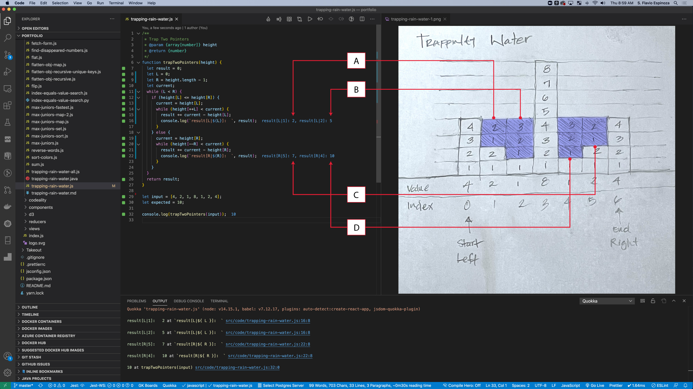
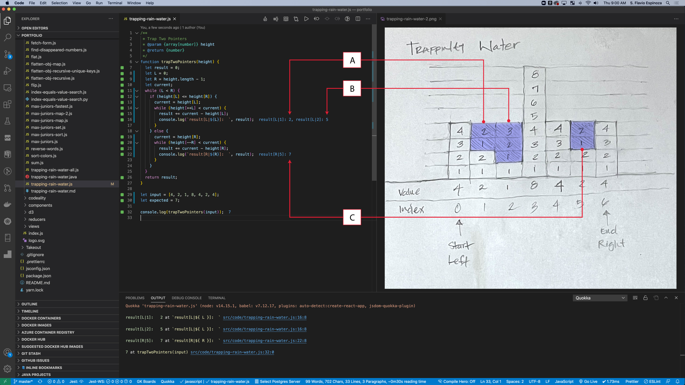
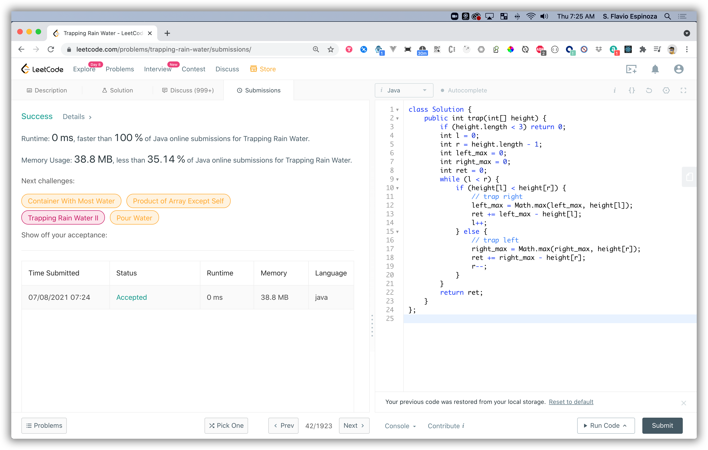

# Trapping Rain Water

```js
00000|            index { start }
00   |
000000000|        index { start > index < max }
00000    |
00       |
000000000000000  index {max}
0          |
000000     |
000000000  |
00         |
000        |
00000000000|     index {end}
```

## Problem


## Solution

### JavaScript - Two Pointers

```js
function trap(height) {
  let result = 0;
  let start = 0;
  let end = height.length - 1;
  let current;
  while (start < end) {
    if (height[start] <= height[end]) {
      // start left, trap right  
      current = height[start];
      while (height[++start] < current) {
        result += current - height[start]; // A, B
      }
    } else {
      // start right, trap left  
      current = height[end];
      while (height[--end] < current) {
        result += current - height[end]; // C, D
      }
    }
  }
  return result;
}
```





### Java - Two Pointers

Same solution as above in Java

```java
class Solution {
    public int trap(int[] height) {
        int result = 0;
        int start = 0;
        int end = height.length - 1;
        while (start < end) {
            if (height[start] <= height[end]) {
                // start left, trap right
                int current = height[start];
                while (height[++start] < current) {
                    result += current - height[start]; // A, B
                }
            } else {
                // start right, trap left
                int current = height[end];
                while(height[--end] < current) {
                    result += current - height[end]; // C, D
                }
            }
        }
        return result;
    }
}
```

### Java - Two Pointers (fastest)

Fastest solution in Java

- Runtime: **0ms**, faster than **100%** of Java submissions on LeetCode.com

```java
class Solution {
    public int trap(int[] height) {
        if (height.length < 3) return 0;
        int l = 0;
        int r = height.length - 1;
        int left_max = 0;
        int right_max = 0;
        int ret = 0;
        while (l < r) {
            if (height[l] < height[r]) {
                // start left, trap right
                left_max = Math.max(left_max, height[l]);
                ret += left_max - height[l]; // A, B
                l++;
            } else { 
                // start right, trap left
                right_max = Math.max(right_max, height[r]);
                ret += right_max - height[r]; // C, D
                r--;
            }
        }
        return ret;
    }
};
```



### Brute Force

#### JavaScript

```js
function trap(height) {
  if (!height.length && height.length < 3) return 0;

  let ans = 0;
  let size = height.length;
  const left_max = [];
  const right_max = [];

  // find left_max
  left_max[0] = height[0];
  for (let i = 1; i < size; i++) {
    left_max[i] = Math.max(height[i], left_max[i - 1]);
  }

  // find right_max
  right_max[size - 1] = height[size - 1];
  for (let i = size - 2; i >= 0; i--) {
    right_max[i] = Math.max(height[i], right_max[i + 1]);
  }

  // += min of (left_max, right_max) minus height
  for (let i = 1; i < size - 1; i++) {
    let min = Math.min(left_max[i], right_max[i]) - height[i];
    ans += min;
  }

  return ans;
}
```
